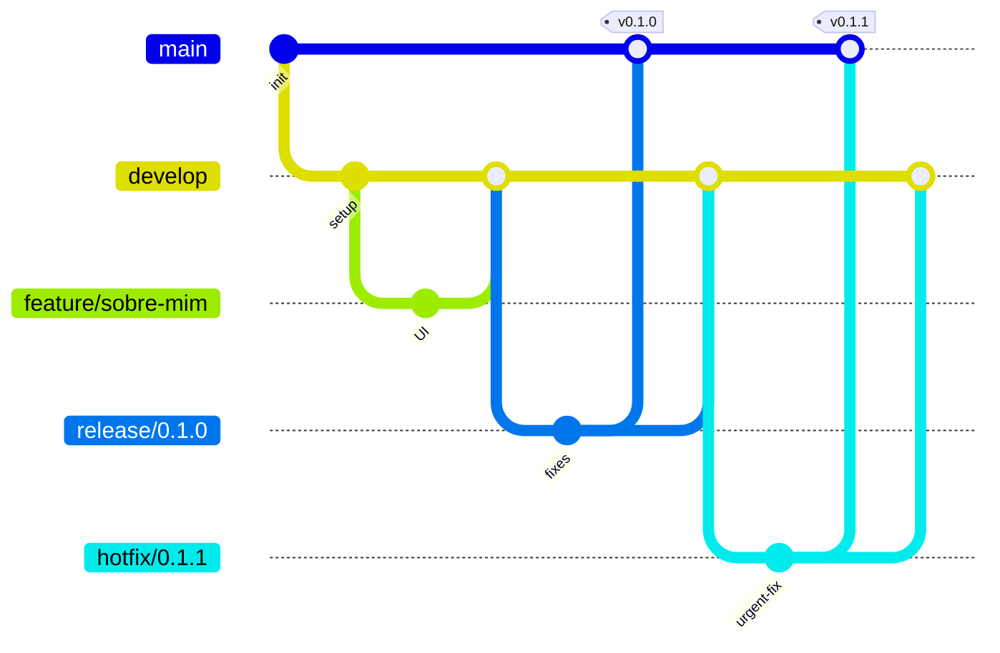

# Guia Prático: GitFlow aplicado ao seu Portfólio em React (Lovable + Vercel)

Este guia é um **passo a passo detalhado** para você aplicar o **GitFlow** no seu projeto pessoal de portfólio.  
O projeto já foi criado no **Lovable**, está publicado na **Vercel** e versionado no **GitHub**.  
Agora, o foco é **aprender Git na prática** simulando o fluxo de desenvolvimento profissional.

---

## 1. Conceitos básicos

Antes de praticar, entenda os conceitos:

- **Branch (ramo)**: linha de trabalho paralela no Git.
- **Commit**: registro das alterações feitas.
- **Push**: envia suas alterações locais para o GitHub.
- **Pull**: traz alterações do GitHub para sua máquina.
- **Pull Request (PR)**: solicitação de integração de uma branch em outra.
- **Main**: branch de produção (o que está publicado).
- **Develop**: branch de integração contínua (base de novas funcionalidades).
- **Feature**: branch para desenvolver uma nova funcionalidade.
- **Release**: branch para preparar uma nova versão.
- **Hotfix**: branch para corrigir algo urgente em produção.

---

## 2. Estrutura inicial (já existente)

Você já tem:

- Projeto React criado pelo **Lovable**.
- Repositório hospedado no **GitHub**.
- Deploy automático configurado na **Vercel** (a partir da branch `main`).

Agora, vamos organizar o **fluxo de trabalho com GitFlow**.

---

## 3. Criar a branch `develop`

1. Verifique se está na branch `main`:

```bash
git checkout main
git pull
```

2. Crie a branch `develop` a partir da `main`:

```bash
git checkout -b develop
git push -u origin develop
```

3. No GitHub, proteja as branches `main` e `develop` (*Settings → Branches → Branch protection rules*).

---

## 4. Criar uma branch de *feature*

**Exemplo**: Alterar a seção “Sobre Mim” no portfólio.

1. Certifique-se de estar na `develop`:

```bash
git checkout develop
git pull
```

2. Crie a branch de *feature*:

```bash
git checkout -b feature/sobre-mim
```

3. Implemente a funcionalidade no código (ex.: Alterar `AboutMe.jsx` e importar no `App.jsx`).

4. Faça commit e push:

```bash
git add .
git commit -m "feat: ajustes na seção Sobre Mim"
git push -u origin feature/sobre-mim
```

5. Abra um **Pull Request (PR)** no GitHub:  
   - Base: `develop`  
   - Compare: `feature/sobre-mim`  
   - Escreva uma descrição clara.  

6. Após revisão, faça o merge do PR.  
7. Delete a branch de *feature* (opcional).  

---

## 5. Preparar uma *release*

Quando várias *features* estiverem prontas:

1. Crie uma branch de release a partir da `develop`:

```bash
git checkout develop
git pull
git checkout -b release/0.1.0
```

2. Ajuste arquivos de versão/documentação (`package.json`, `CHANGELOG.md`).

3. Commit e push:

```bash
git add .
git commit -m "chore(release): prepara versão 0.1.0"
git push -u origin release/0.1.0
```

4. Abra um PR da `release/0.1.0` para `main`.  
5. Após o merge, crie uma **tag de versão**:

```bash
git checkout main
git pull
git tag -a v0.1.0 -m "Primeira release"
git push origin v0.1.0
```

6. Abra também um PR de `release/0.1.0` → `develop` para manter as branches alinhadas.  

---

## 6. Criar um *hotfix*

Caso um bug em produção precise de correção imediata:

1. Crie a branch a partir de `main`:

```bash
git checkout main
git pull
git checkout -b hotfix/corrige-link-menu
```

2. Corrija o problema e faça commit:

```bash
git add .
git commit -m "fix: corrige link do menu"
git push -u origin hotfix/corrige-link-menu
```

3. Abra um PR da `hotfix/corrige-link-menu` → `main`.  
4. Após o merge, crie uma nova tag de versão (ex.: `v0.1.1`).  
5. Não esqueça de abrir também um PR de volta para `develop`.  

---

## 7. Deploy automático na Vercel

- Sua `main` já está conectada à Vercel → cada merge em `main` dispara um deploy automático.  
- Perceba que existe **Preview Deploys** para cada PR (ótimo para revisar antes de integrar).
- Vamos entender melhor essa parte na segunda parte da aula <spoiler>

---

## 8. Verificações úteis

- Verificar status atual:
```bash
git status
```

- Ver histórico resumido:
```bash
git log --oneline --graph --decorate --all
```

- Ver branches:
```bash
git branch -a
```

---

## 📋 9. Atividade prática (entrega)

1. Crie a branch `develop` no seu repositório.  
2. Crie uma *feature* (`feature/sobre-mim`), implemente algo simples ou faça um ajuste e faça PR para `develop`.  
3. Crie uma `release/0.1.0` e faça PR para `main`.  
4. Gere a tag `v0.1.0`.  
5. Simule um *hotfix* simples (ex.: mudar um texto).  
6. Mostre no relatório no bloco de notas, word, google docs:
    - Captura de tela dos PRs no GitHub.  
    - Saída do comando:
         ```bash
         git log --oneline --graph --decorate --all
         ```
    - Link do site publicado na **Vercel**.
7. Envie para meu email: pedroeckel@gmail.com


---

## 📝 10. Resumo visual do fluxo


